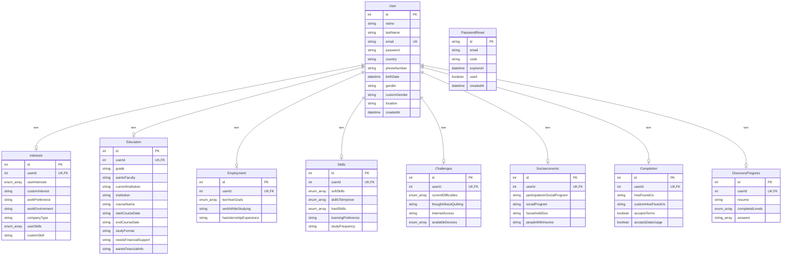

# 🗃️ Documentação do Banco de Dados

## 📋 Índice
- [Visão Geral](#visão-geral)
- [Modelo Relacional](#modelo-relacional)
- [Tabelas Detalhadas](#tabelas-detalhadas)
- [Enums](#enums)
- [Relacionamentos](#relacionamentos)
- [Comandos Úteis](#comandos-úteis)
- [Exemplos de Consultas](#exemplos-de-consultas)

---

## Visão Geral

O banco de dados utiliza **PostgreSQL** com **Prisma ORM** e segue um modelo centrado no usuário, onde cada pessoa possui informações detalhadas distribuídas em múltiplas tabelas relacionadas.

### Características
- **8 tabelas principais** + tabela de reset de senha
- **Relacionamento 1:1** entre User e demais tabelas
- **Arrays de enums** para choices múltiplas
- **Timestamps automáticos** para auditoria

---

## Modelo Relacional



---

## Tabelas Detalhadas

### 👤 User (Tabela Central)
**Propósito:** Informações básicas do usuário

| Campo | Tipo | Obrigatório | Descrição |
|-------|------|-------------|-----------|
| `id` | Int | ✅ | ID único (auto-increment) |
| `name` | String | ✅ | Nome do usuário |
| `lastName` | String | ✅ | Sobrenome |
| `email` | String | ✅ | Email único |
| `password` | String | ✅ | Senha hasheada |
| `country` | String | ✅ | País de origem |
| `phoneNumber` | String | ✅ | Telefone |
| `birthDate` | DateTime | ✅ | Data de nascimento |
| `gender` | String | ✅ | Gênero |
| `customGender` | String | ❌ | Gênero customizado |
| `location` | String | ✅ | Localização |
| `createdAt` | DateTime | ✅ | Data de criação (auto) |

### 🎯 Interests
**Propósito:** Interesses profissionais e preferências

| Campo | Tipo | Descrição |
|-------|------|-----------|
| `userInterests` | UserInterestsEnum[] | Áreas de interesse |
| `customInterest` | String? | Interesse customizado |
| `workPreference` | String | Preferência de trabalho |
| `workEnvironment` | String | Ambiente de trabalho preferido |
| `companyType` | String | Tipo de empresa preferida |
| `userSkills` | UserSkillsEnum[] | Habilidades do usuário |
| `customSkill` | String? | Habilidade customizada |

### 🎓 Education
**Propósito:** Informações educacionais

| Campo | Tipo | Descrição |
|-------|------|-----------|
| `grade` | String | Escolaridade atual |
| `wantsFaculty` | String | Deseja fazer faculdade |
| `currentInstitution` | String? | Instituição atual |
| `institution` | String? | Instituição desejada |
| `courseName` | String? | Nome do curso |
| `startCourseDate` | String? | Data de início |
| `endCourseDate` | String? | Data de término |
| `studyFormat` | String | Formato de estudo |
| `needsFinancialSupport` | String | Precisa de apoio financeiro |
| `wantsFinancialInfo` | String | Quer informações financeiras |

### 💼 Employment
**Propósito:** Objetivos profissionais

| Campo | Tipo | Descrição |
|-------|------|-----------|
| `twoYearGoals` | TwoYearGoalsEnum[] | Metas para 2 anos |
| `workWhileStudying` | String | Trabalhar enquanto estuda |
| `hasInternshipExperience` | String | Tem experiência de estágio |

### 🧠 Skills
**Propósito:** Habilidades e desenvolvimento

| Campo | Tipo | Descrição |
|-------|------|-----------|
| `softSkills` | SoftSkillsEnum[] | Habilidades interpessoais |
| `skillsToImprove` | SoftSkillsEnum[] | Habilidades a melhorar |
| `hardSkills` | HardSkillsEnum[] | Habilidades técnicas |
| `learningPreference` | String | Preferência de aprendizagem |
| `studyFrequency` | String | Frequência de estudo |

### 🎮 DiscoveryProgress
**Propósito:** Progresso no sistema gamificado

| Campo | Tipo | Descrição |
|-------|------|-----------|
| `resume` | String? | Resumo gerado pelo sistema |
| `completedLevels` | DiscoveryLevel[] | Níveis completados |
| `answers` | String[] | Respostas do usuário |

---

## Enums

### UserInterestsEnum
```typescript
saude | tecnologia | negocios | engenharia | arte_design | 
comunicacao | meio_ambiente | educacao | empreendedorismo | 
financas | outro
```

### UserSkillsEnum
```typescript
comunicacao | organizacao | criatividade | logica | lideranca | 
adaptabilidade | trabalho_equipe | idiomas | programacao | excel | 
ferramentas_digitais | resolucao_problemas | outra
```

### TwoYearGoalsEnum
```typescript
conseguir_emprego | ingressar_faculdade | curso_tecnico | 
empreender | aprender_ferramenta_tecnica | melhorar_habilidades_sociais | 
fazer_intercambio | aprender_idioma | ainda_nao_sei
```

### SoftSkillsEnum
```typescript
comunicacao | criatividade | persistencia | organizacao | 
trabalho_equipe | empatia | lideranca | flexibilidade | 
resolucao_problemas | inteligencia_emocional
```

### HardSkillsEnum
```typescript
excel | power_bi | canva | python | banco_dados | 
atendimento_cliente | criacao_conteudo | vendas | 
design_grafico | nenhuma
```

### DifficultiesEnum
```typescript
organizacao | entendimento | ansiedade | carreira | 
estrutura_de_estudo | nenhuma
```

### DevicesEnum
```typescript
celular | computador | tablet | nenhum
```

### DiscoveryLevel
```typescript
library | florest | city | cybercity
```

---

## Relacionamentos

### 🔗 User → Tabelas Relacionadas
- **Tipo:** 1:1 (um usuário pode ter um registro em cada tabela)
- **Chave estrangeira:** `userId` em todas as tabelas relacionadas
- **Cascade:** Deletar usuário deleta todos os registros relacionados

### 📊 Distribuição Típica
- **Users com Interests:** ~100% (obrigatório no fluxo)
- **Users com Education:** ~100% (obrigatório no fluxo)
- **Users com Discovery Progress:** ~60-70%
- **Users com Resume:** ~50%

---

## Comandos Úteis

### Visualização e Exploração
```bash
# Interface gráfica para visualizar dados
npx prisma studio

# Introspeccionar banco existente
npx prisma db pull

# Verificar status das migrações
npx prisma migrate status
```

### Desenvolvimento
```bash
# Aplicar mudanças do schema
npx prisma db push

# Criar nova migração
npx prisma migrate dev --name "nome_da_migracao"

# Regenerar cliente após mudanças
npx prisma generate

# Reset completo (CUIDADO!)
npx prisma migrate reset
```

### Backup e Restore
```bash
# Backup (usando pg_dump)
pg_dump $DATABASE_URL > backup.sql

# Restore
psql $DATABASE_URL < backup.sql

# Seed (popular com dados de teste)
npx prisma db seed
```

---

## Exemplos de Consultas

### Consultas Básicas

#### Buscar usuário completo
```typescript
const user = await prisma.user.findUnique({
  where: { email: "usuario@email.com" },
  include: {
    interests: true,
    education: true,
    employment: true,
    skills: true,
    challenges: true,
    socioeconomic: true,
    completion: true,
    discoveryProgress: true
  }
});
```

#### Usuários com progresso no Discovery
```typescript
const usersWithProgress = await prisma.user.findMany({
  where: {
    discoveryProgress: {
      completedLevels: {
        hasSome: ["library", "florest"]
      }
    }
  },
  include: {
    discoveryProgress: {
      select: {
        completedLevels: true,
        resume: true
      }
    }
  }
});
```

### Consultas Estatísticas

#### Usuários por país
```typescript
const usersByCountry = await prisma.user.groupBy({
  by: ['country'],
  _count: {
    country: true
  },
  orderBy: {
    _count: {
      country: 'desc'
    }
  }
});
```

#### Distribuição de interesses
```typescript
const interests = await prisma.interests.findMany({
  select: {
    userInterests: true
  }
});

// Processar no código para contar cada interesse
```

### Consultas de Filtro

#### Usuários por habilidades técnicas
```typescript
const techUsers = await prisma.user.findMany({
  where: {
    skills: {
      hardSkills: {
        hasOther: ["python", "banco_dados"]
      }
    }
  },
  include: {
    skills: true
  }
});
```

#### Usuários que precisam de suporte financeiro
```typescript
const needsSupport = await prisma.user.findMany({
  where: {
    education: {
      needsFinancialSupport: "sim"
    }
  },
  include: {
    education: {
      select: {
        needsFinancialSupport: true,
        wantsFinancialInfo: true
      }
    }
  }
});
```

---

## 🔧 Troubleshooting

### Problemas Comuns

#### ❌ "Relation does not exist"
- Execute: `npx prisma db push`
- Verifique se as migrações foram aplicadas

#### ❌ "Unique constraint violation"
- Verifique se não está tentando inserir email duplicado
- Confirme unicidade de `userId` nas tabelas relacionadas

#### ❌ "Invalid enum value"
- Verifique se está usando valores válidos dos enums
- Execute `npx prisma generate` após mudanças

### Performance

#### 🚀 Otimizações Recomendadas
- Use `select` em vez de `include` quando possível
- Implemente paginação com `skip` e `take`
- Considere índices para campos de busca frequente

```typescript
// ❌ Traz dados desnecessários
const users = await prisma.user.findMany({
  include: { interests: true }
});

// ✅ Traz apenas o necessário
const users = await prisma.user.findMany({
  select: {
    id: true,
    name: true,
    email: true,
    interests: {
      select: {
        userInterests: true
      }
    }
  }
});
```

---

**💡 Dica:** Use sempre o Prisma Studio (`npx prisma studio`) para explorar e entender melhor a estrutura dos dados!
